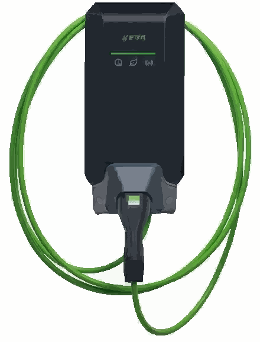

# iobroker.modbus-keba-p40

# FENECON EMS Modbus Adapter

Dieser Adapter liest/schreibt Modbus-Register des **FENECON EMS** über Modbus TCP.  
**Wichtig:** Schreibzugriffe sind nur mit der **FENECON Modbus Write App** möglich!!!!!!

## Bezug der Write App
Die **FENECON Modbus Write App** ist über **Nexowatt** erhältlich.  
Bitte per **E-Mail** anfragen (Kontaktadresse info@nexowatt.com verwenden).

> **E-Mail-Vorlage**
> Betreff: Anfrage – FENECON Modbus Write App  
> Text:  
> Guten Tag,  
> ich möchte die FENECON Modbus Write App beziehen. es handelt sich um einem Homespeicher / Gewerbespeicher.  
> Bitte senden Sie mir Informationen zu Lizenz, Preis und Bezug.  
> Vielen Dank!

## Voraussetzungen
- FENECON EMS  Homespeicher, Gewerbespeicher
- Netzwerkzugriff zum EMS (IP/Port, Standard meist **502**)
- Für Schreibzugriffe: **FENECON Modbus Write App** (Bezug via Nexowatt, Anfrage per E-Mail)

## Funktionen
- Lesen der **Holding-** und **Input-Register**
- Optionales **Schreiben** von Holding-Registern (nur mit Write App)

## Installation
1. Adapter installieren (z. B. via Paketmanager/Repository deines Systems).  
2. Dienst/Instanz starten.

## Konfiguration
1. **Verbindung:** IP-Adresse des EMS und Port (Standard 502) eintragen.   
2. **Schreiben aktivieren (optional):**  
   - FENECON Modbus Write App installieren/aktivieren: über das FEMS App center und Lizenzsclüssel eingeben und installieren (Bezug Lizenzschlüssel via Nexowatt per E-Mail).  

# FENECON EMS Modbus Adapter

This adapter reads/writes **FENECON EMS** Modbus registers via **Modbus TCP**.  
**Important:** Write access is only possible with the **FENECON Modbus Write App**.

## How to obtain the Write App
The **FENECON Modbus Write App** is available via **Nexowatt**.  
Please request it **by email** (use the contact address **info@nexowatt.com**).

> **Email template**
> Subject: Request – FENECON Modbus Write App  
> Body:  
> Hello,  
> I would like to obtain the FENECON Modbus Write App. The system is a **home storage / commercial storage** installation.  
> Please send me information about licensing, price, and how to purchase.  
> Thank you!

## Requirements
- FENECON EMS (home storage or commercial storage)
- Network access to the EMS (IP/port, typically **502**)
- For write access: **FENECON Modbus Write App** (available from Nexowatt, request via email)

## Features
- Read **holding** and **input** registers
- Optional **write** to holding registers (requires the Write App)

## Installation
1. Install the adapter (e.g., via your system’s package manager/repository).  
2. Start the service/instance.

## Configuration
1. **Connection:** Enter the EMS IP address and port (default **502**).  
2. **Enable writing (optional):**  
   - Install/activate the **FENECON Modbus Write App** via the **FEMS App Center** and enter your **license key** (license key available from Nexowatt via email).

It uses [@iobroker/modbus](https://github.com/ioBroker/modbus) library to read the data.

<!--
	### **WORK IN PROGRESS**
-->
## Changelog
### 0.1.3 (2025-10-21)
* (NexoWatt) real publish

### 0.0.4 (2025-10-08)
* (NexoWatt) initial commit

## License
The MIT License (MIT)

Copyright (c) 2025 Nexowatt <info@nexowatt.com>

Permission is hereby granted, free of charge, to any person obtaining a copy
of this software and associated documentation files (the "Software"), to deal
in the Software without restriction, including without limitation the rights
to use, copy, modify, merge, publish, distribute, sublicense, and/or sell
copies of the Software, and to permit persons to whom the Software is
furnished to do so, subject to the following conditions:

The above copyright notice and this permission notice shall be included in
all copies or substantial portions of the Software.

THE SOFTWARE IS PROVIDED "AS IS", WITHOUT WARRANTY OF ANY KIND, EXPRESS OR
IMPLIED, INCLUDING BUT NOT LIMITED TO THE WARRANTIES OF MERCHANTABILITY,
FITNESS FOR A PARTICULAR PURPOSE AND NONINFRINGEMENT. IN NO EVENT SHALL THE
AUTHORS OR COPYRIGHT HOLDERS BE LIABLE FOR ANY CLAIM, DAMAGES OR OTHER
LIABILITY, WHETHER IN AN ACTION OF CONTRACT, TORT OR OTHERWISE, ARISING FROM,
OUT OF OR IN CONNECTION WITH THE SOFTWARE OR THE USE OR OTHER DEALINGS IN
THE SOFTWARE.
